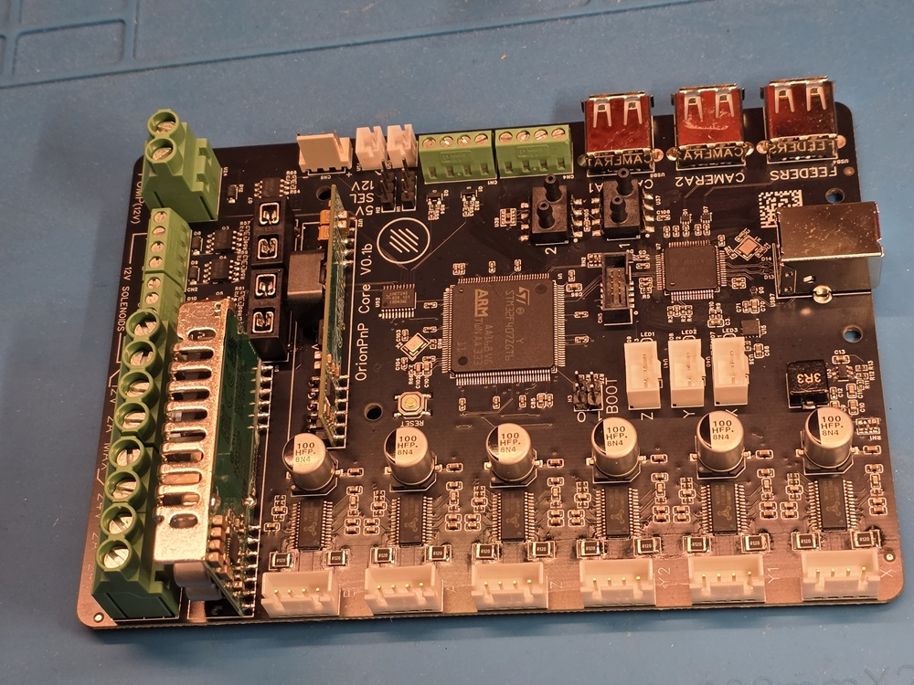

# OrionPnP

> ⚠️ **DISCLAIMER:** This is still a prototype. Testing and validation will begin after the first boards are assembled. Modifications to schematic, PCB, and BOM may still occur.

---

## What is OrionPnP?

**OrionPnP** is a DIY Pick-and-Place (PnP) machine project designed to work with [OpenPnP](http://openpnp.org).  
The goal is to reliably place at least 0402-sized components with minimal user intervention — affordably and effectively.

---

## Why This Project?

Most DIY PnP machines out there are either:
- Too expensive
- Too compromised

OrionPnP aims to be the "**minimum effort** for maximum reliability" solution — an accessible, no-nonsense PnP platform that just works.

---

## Why a Custom Mainboard?

Existing boards (like 3D printer boards) are:
- Often overpriced
- Packed with features not needed in PnP machines (e.g., CAN, excessive IO)

So OrionPnP introduces a dedicated controller that only includes **what’s actually needed** for a PnP machine.

---

## Key Features

### 🔧 Motion & Control
- 6x **TMC2226 stepper drivers** (with sensorless homing & UART)
- 4x 12V **solenoid outputs** (with flyback diodes)
- 2x 12V **LED ring outputs** (for cameras)
- 1x 12V **vacuum pump output** (with protection)

### 🔌 Power & Expandability
- Multiple 24V / 12V / 5V headers for accessories
- 2x **2-pin fan headers** (selectable 5V or 12V)
- 1x **4-pin PC fan header** (12V, no PWM)
- Compact **12V & 5V buck modules** onboard
- Fused 5V and 12V rails (automotive fuses)

### 📡 Sensing
- 2x **I2C differential pressure sensors** for vacuum detection  
  (Each on its own isolated bus)

### 🔗 Connectivity
- Integrated **USB 3.0 Hub**
  - 3x downstream USB2.0 high-speed ports
  - USB3.0 Type-B connector for PC interface
  - One port reserved for future **feeder board**

---

## Software Approach

OrionPnP runs a **custom Marlin 2.0 firmware**, chosen for:
- Familiarity and flexibility
- Good support in OpenPnP with minor tweaks

While some features still need implementation, most of the system will follow the mainline Marlin structure for maintainability.

OpenPnP profiles and macros will be published once hardware validation begins.

---

## Project Scope

The **Core board** is ready for prototyping.  
The rest of the project (feeders, mechanics, etc.) will follow after successful validation.

Everything — CAD, firmware, configurations — will be **open source**.

---

## 💬 Contributing

You're welcome to:
- Fork, test, and explore the project
- Report bugs or hardware issues
- Contribute improvements

Just be sure to sync with the repo before making large changes — things are moving fast!

---

## 🚧 TESTING HAS STARTED!

Big thanks to the **OSHWLab Stars initiative** for helping kick this off 🎉

### ✅ Power
All rails work great! A datasheet misread caused an early issue, but it's now fixed and added to the schematic.

### ⚠️ USB
Minor flaws were discovered in the USB hub design.
- Hardware patching allowed testing to continue
- v02 will include a more reliable package and layout
- USB stability testing is still ongoing

### ✅ MCU
- Flashes fine and runs reliably
- Custom Marlin firmware compiles and uploads correctly
- GCODE is being read and interpreted correctly

### ⏳ Pending Tests
- Solenoid, pump, LED outputs
- Vacuum sensors
- Full IO test suite once i get motors to test the drivers with (and heatsinks)

---

Stay tuned for updates on the feeders, mechanical parts, and full assembly instructions!
